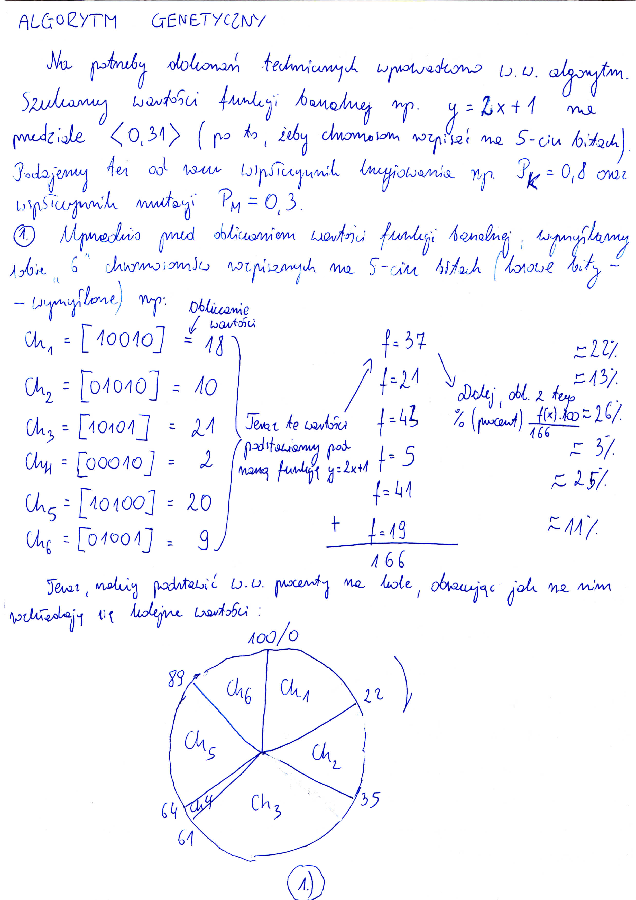
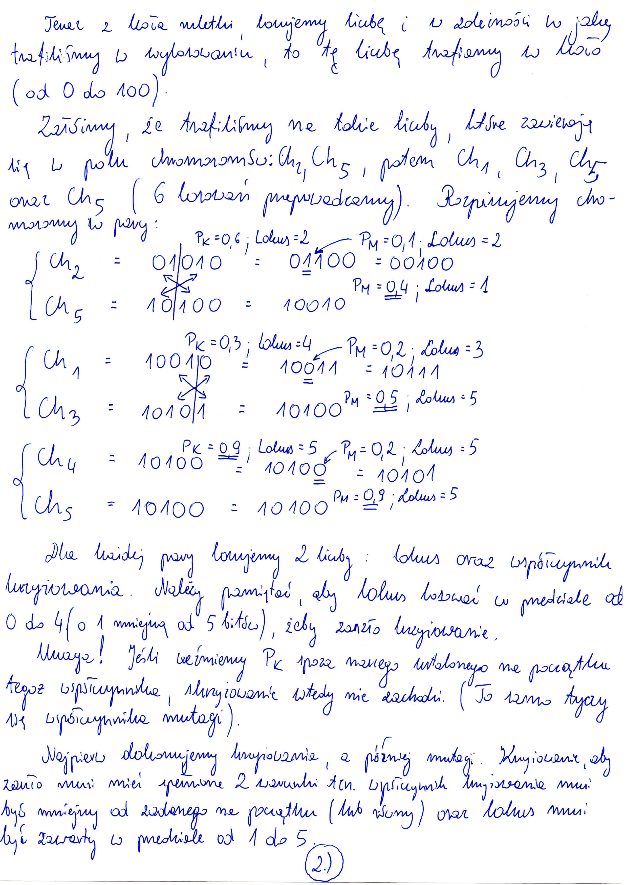
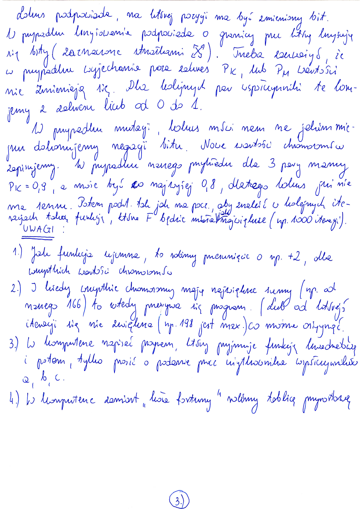

# Genetic Algorithm
> Own Java Genetic Algorithm project implementation

## Table of contents
* [General info](#general-info)
* [Technologies](#technologies)
* [Setup](#setup)
* [Features](#features)
* [Status](#status)
* [Contact](#contact)

## General info
Java Genetic Algorithm project implementation. See 'Description' below.

## Description

## Technologies
* Java SE version 8

## Setup
Simply in Command line (for Windows type: Win + R -> cmd -> (%PATH% to proper Java program directory -> javac MaxGenetic.java -> java MaxGenetic)

## Code Examples
Shows snippets of my Genetic Algorithm code:
`public static void main(String args[]) {
		Scanner scr = new Scanner(System.in);
		System.out.println("Podaj wspolczynniki funkcji kwadratowej a,b,c:");
		System.out.print("a = ");
		MaxGenetic.a = scr.nextDouble();
		System.out.print("b = ");
		MaxGenetic.b = scr.nextDouble();
		System.out.print("c = ");
		MaxGenetic.c = scr.nextDouble();
		scr.close();
		
		MaxGenetic.findMaximum();
	}`

## Features
List of features:
* maximilisation function
* getting from console parametric square function
* return 'locus' (power of two & random locus)
* generator random numbers of individuals
* first make a start population
* added random individuals
* crossing & mutation individuals from new population
... etc

## Status
Project is:  _finished_?

## Contact
Powered by [@techalive] - feel free to contact me!